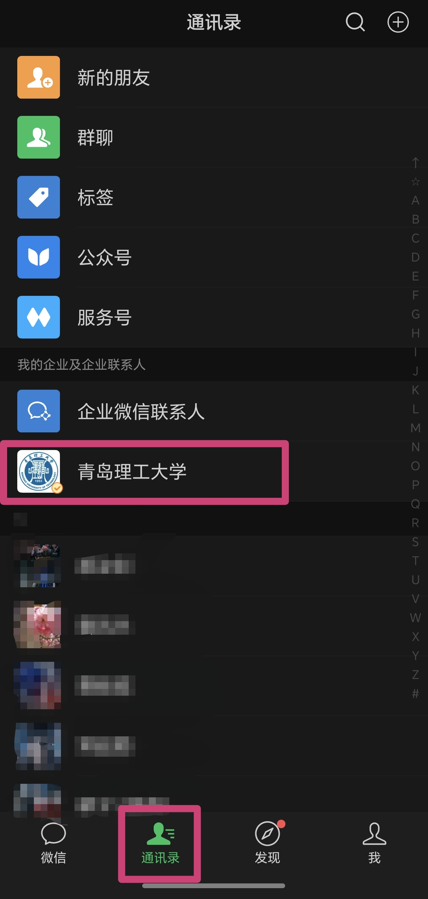
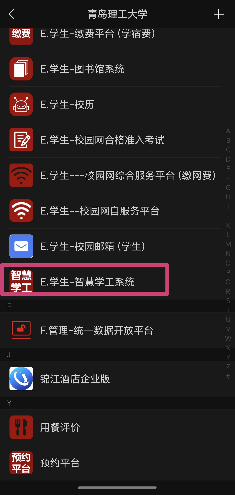
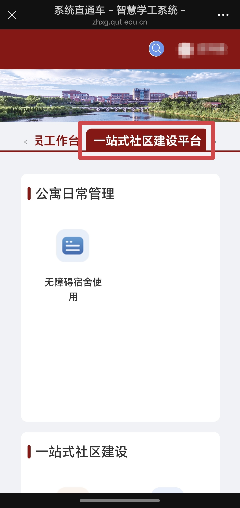
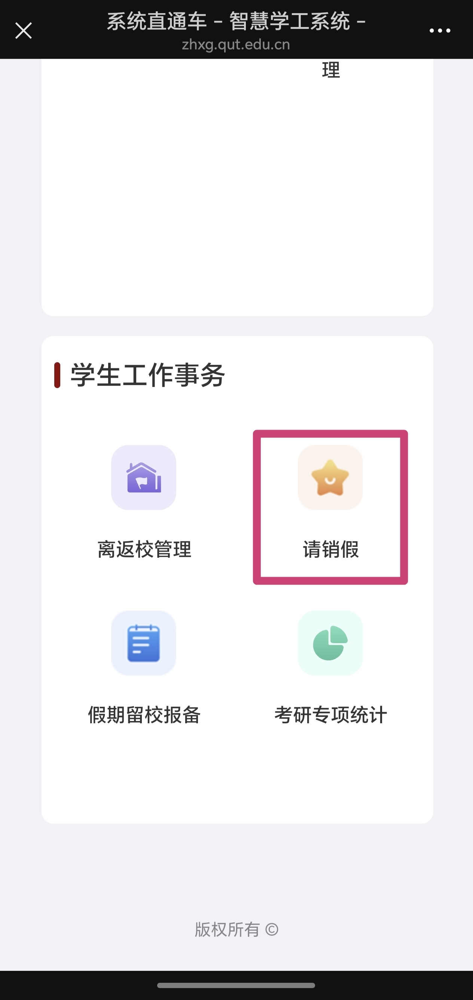
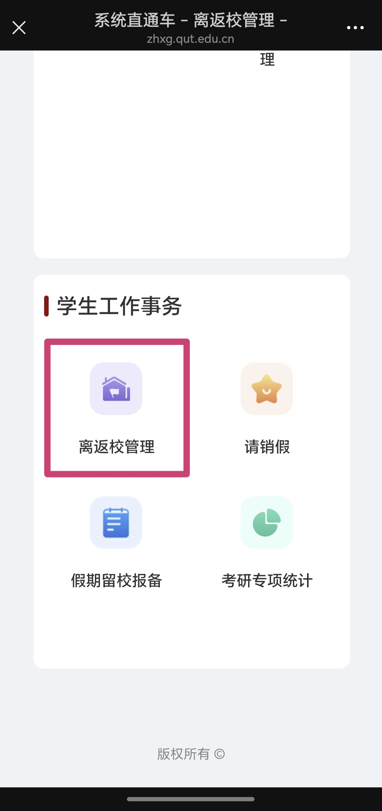

# 智慧学工系统

智慧学工系统内涵盖了**学生信息管理、无障碍宿舍使用、活动室管理、家长进宿舍管理、离返校管理、请销假、假期留校报备、考研专项统计**等实用功能，在大学的日常生活中使用率很高，本文介绍最常用的的**请销假**和**离返校管理**功能的位置及使用方法。

学生账号为**学号**，默认密码为**QDLG@身份证后六位**，进入系统后可修改。

## 请销假流程

- 打开微信，选择通讯录，点击**青岛理工大学**

- 向下滑动，找到**E.学生-智慧学工系统**，进入

- 选择**一站式社区建设平台**，向下滑动，找到**请销假**，进入

- 按照要求填写相关信息，相关证明一般需要家长知情截图，具体要求按照导员通知填写。若上次请假未销假，则无法再次请假，请通过左上角菜单切换至销假页面销假。
- 当导员批准后会在在**请销假**页面显示。

## 离返校登记

离返校登记一般在法定节假日前执行，具体请关注班级群内通知。

- 打开微信，选择通讯录，点击**青岛理工大学**

- 向下滑动，找到**E.学生-智慧学工系统**，进入

- 选择**一站式社区建设平台**，向下滑动，找到**离返校管理**，进入

- 按照要求和实际情况进行填写即可

## 其他功能

进入对应的功能页面后，按照要求正常填写信息即可。